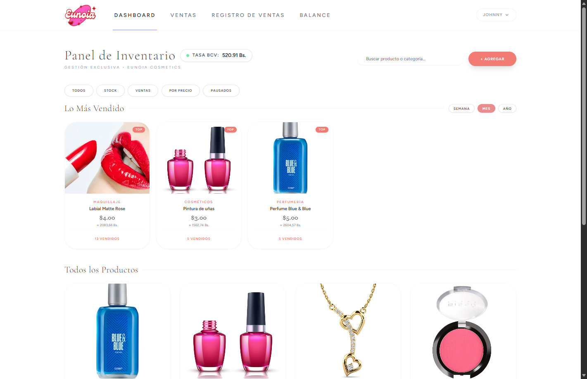
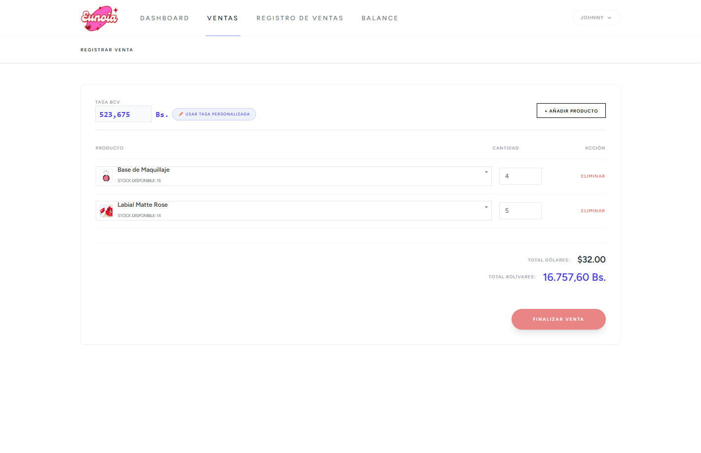
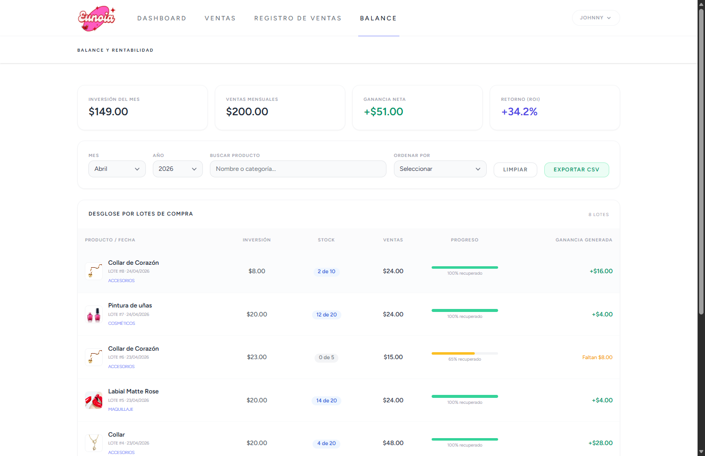
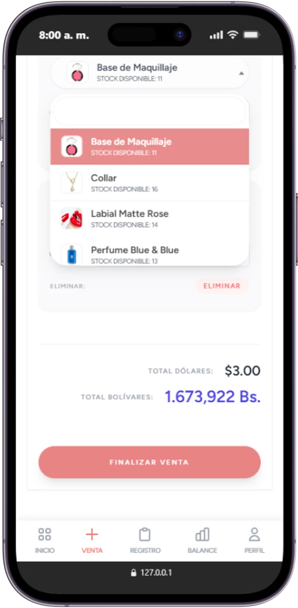

<div align="center">

# Eunoia Sistema

**Sistema de gestión de inventario y punto de venta con lógica contable FIFO y soporte multi-moneda en tiempo real.**

[](https://php.net)
[](https://laravel.com)
[](https://vitejs.dev)
[](https://tailwindcss.com)
[](LICENSE)

</div>

---

> **El problema que resuelve:** En negocios con alta rotación de inventario y economías con fluctuación cambiaria, calcular la ganancia real de cada venta es casi imposible de forma manual. Los precios de compra cambian, el tipo de cambio fluctua por hora, y los sistemas genéricos no distinguen entre el costo de un lote antiguo y uno reciente. Eunoia resuelve esto con precisión contable.

---

## Vista previa

<div align="center">
  
  <br/><br/>
  
  <br/><br/>
  
  <br/><br/>
  
</div>

---

## Características principales

**Inventario por lotes (FIFO)**
Cada compra genera un lote con su costo unitario registrado. Al vender, el sistema descuenta automáticamente del lote más antiguo con existencia disponible. Si una venta supera la capacidad de un lote, avanza al siguiente sin intervención manual.

**Cálculo de ganancia real por item**
La ganancia no se calcula sobre un precio promedio. Se calcula comparando el precio de venta de cada `SaleItem` contra el costo exacto del lote del que salió el producto. Esto permite detectar márgenes reales incluso si compraste el mismo producto en 3 fechas distintas a 3 precios distintos.

**Multi-moneda dinámica**
El `DolarService` consulta la API del BCV cada 30 minutos y cachea el resultado. Los precios se fijan en USD; el total en Bolívares se calcula en el momento de la venta usando la tasa vigente. Si la API falla, el sistema cae automáticamente a una tasa manual configurada por el administrador.

**Transacciones atómicas**
Ventas y cancelaciones están envueltas en DB Transactions. Si una operación falla a mitad de camino, el stock no se modifica. En cancelaciones, el sistema rastrea exactamente de qué lotes salió la mercancía y restaura esas cantidades específicas.

---

## Stack tecnológico

| Capa | Tecnología | Versión |
|---|---|---|
| Backend | PHP + Laravel | 8.3.1 / 13.5.0 |
| Base de datos | MySQL / SQLite | ACID compliant |
| Frontend | Vite + Alpine.js | 8.0.0 / 3.4.2 |
| Estilos | Tailwind CSS | 3.1.0 |
| HTTP client | Axios | 1.15.0 |
| API externa | DolarAPI (BCV) | — |

---

## Instalación

### Requisitos previos

- PHP >= 8.3
- Composer >= 2.x
- Node.js >= 18 + NPM
- MySQL 8 o SQLite

### Setup

```bash
# 1. Clonar el repositorio
git clone https://github.com/johnnyarondonp-web/eunoia-sistema.git
cd eunoia-sistema

# 2. Configurar variables de entorno
cp .env.example .env
```

Edita `.env` con tu configuración de base de datos:

```env
DB_CONNECTION=mysql
DB_HOST=127.0.0.1
DB_PORT=3306
DB_DATABASE=eunoia
DB_USERNAME=tu_usuario
DB_PASSWORD=tu_contraseña
```

```bash
# 3. Ejecutar setup automático
# (instala dependencias PHP y JS, genera clave, corre migraciones y compila assets)
composer run setup

# 4. Iniciar servidor de desarrollo
composer run dev
```

La aplicación estará disponible en `http://localhost:8000`.

---

## Estructura de archivos clave

```
app/
├── Services/
│   ├── LotDeductionService.php   # Lógica FIFO y trazabilidad de costos
│   └── DolarService.php          # Obtención y respaldo de tasa cambiaria
├── Http/Controllers/
│   └── SaleController.php        # Orquestador de ventas y cancelaciones
└── Models/
    └── Expense.php               # Representa los lotes de entrada de mercancía
```

---

## Módulos

| Módulo | Descripción |
|---|---|
| Dashboard | Vista general de productos activos y estados de stock |
| Productos | Catálogo, control de stock mínimo, estados activo/pausado |
| Ventas | Facturación rápida con búsqueda de productos y cálculo de tasa en tiempo real |
| Balance | Análisis ingresos vs. gastos, exportación de datos y gestión de costos |
| Configuración | Control manual de tasa de cambio y perfiles de usuario |

---

## Licencia

Distribuido bajo la licencia [MIT](LICENSE).
